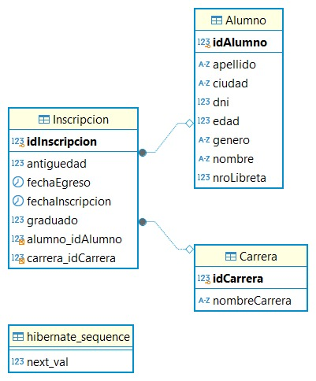
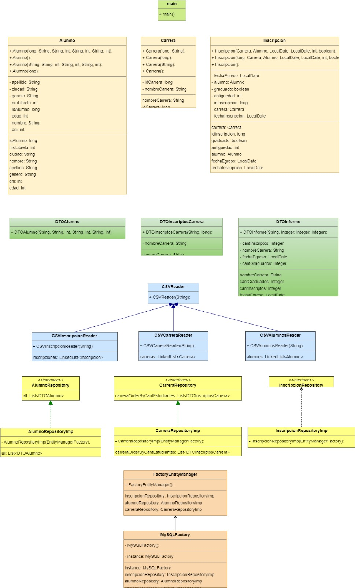
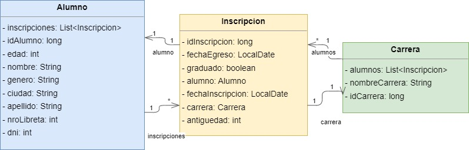

# Arquitecturas Web (TUDAI) - Integrador 2
**Descripción**: El trabajo consiste en la implementación de consultas JPQL utilizando JPA.

**Autores**: Aguerralde, Felicitas; De La Torre, Giuliana; Gramuglia, Eliana; Guidi, Franco; Rodríguez Farías, Julián.

## Características
* **Entidades**:
    * Alumno (long idAlumno, String nombre, String apellido, int edad, int genero, int dni, String ciudad, 
      int nroLibreta)
    * Carrera (long idCarrera, String nombreCarrera)
    * Inscripcion (long idInscripcion, long idCarrera, long idAlumno, LocalDate fechaInscripcion, Local Date fechaEgreso, 
      int antiguedad, boolean graduado)
* **Consultas**:
    * Dar de alta un estudiante.
    * Matricular un estudiante en una carrera.
    * Recuperar todos los estudiantes, y especificar algún criterio de ordenamiento simple.
    * Recuperar un estudiante, en base a su número de libreta universitaria.
    * Recuperar todos los estudiantes, en base a su género.
    * Recuperar las carreras con estudiantes inscriptos, y ordenar por cantidad de inscriptos.
    * Recuperar los estudiantes de una determinada carrera, filtrado por ciudad de residencia.
    * Generar un reporte de las carreras, que para cada carrera incluya información de los
      inscriptos y egresados por año. Se deben ordenar las carreras alfabéticamente, y presentar
      los años de manera cronológica.
* Dentro de la carpeta Diagrams se encuentran los diagramas de objetos y el diagrama DER.

## Tecnologías utilizadas
* JPA (Proveedor: Hibernate), JPQL
* MySQL
* Patrones de arquitecturas web: Factory Method, Abstract Factory, DTO, Repository.

## Conexión a la base de datos
- URL: jdbc:mysql://localhost:3306/integrador_2
- User: root
- Password: _(sin password)_

Nota: Para desplegar la base de datos, utilizar el archivo `docker-compose.yml`.

¡IMPORTANTE! En caso de error TimeZone escribir la siguiente URL en persistence.xml:
`jdbc:mysql://localhost:3306/integrador_2?serverTimezone=America/Argentina/Buenos_Aires`

## Diagramas
### Diagrama DER

### Diagramas de Objetos

